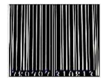
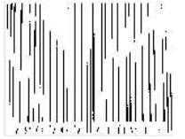
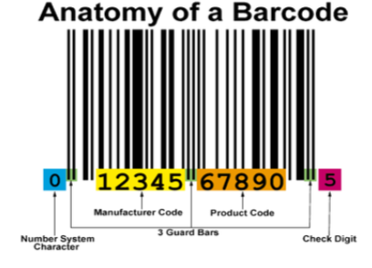

## Tugas 1 Pemerosesan Citra Digital
Nama Anggota  : 
1. Sesilia Miranda 
2. Egyn Terescova Nadia

<h2 align="center">BARCODE</h2>

#### Pendahuluan

Barcode atau dalam Bahasa Indonesia seringkali disebut kode batang adalah an optical machine-readable representation of data. Kode berbentuk garis dan berwarna hitam putih tersebut mengandung satu kumpulan kombinasi yang berlainan ukuran, dan disusun sedemikian rupa menurut aturan tertentu sehingga dapat diterjemahkan oleh mesin pembacanya (Wahyono, 2010). **Barcode sendiri adalah** salah satu cara yang digunakan manusia dalam menjadikan sejumlah data secara khas meliputi nama barang, jenis barang, jumlah, harga, periode suatu barang, dan lain sebagainya. Semua informasi yang dibutuhkan untuk keperluan tertentu mengenai suatu barang akan dijadikan suatu kode yang mempunyai bentuk batang dengan warna hitam/gelap.Barcode juga bisa disebut dengan sederetan garis hitam putih yang disusun secara vertikal dengan tingkat ketebalan yang berbeda. Tingkat ketebalan dan jumlah garis dari barcode memberikan arti pada masing- masing komponen barcode dan membedakan antara jenis barcode yang satu dengan yang lain. Garis putih pada barcode adalah sebagai spasi sedangkan garis hitam menunjukkan pengkodean suatu barcode. Barcode menyediakan suatu metode pengkodean informasi teks yang sederhana dan murah. Barcode juga sebagai media penangkapan informasi data yang cepat dan akurat. Tujuan pokok barcode adalah untuk mengidentifikasi sesuatu dengan memberi label yang berisi barcode.
 

#### Tujuan Pokok

Tujuan pokok barcode adalah untuk mengidentifikasi sesuatu dengan memberi label yang berisi barcode, selain untuk penyandian suatu barang juga dapat digunakan untuk penyandian sistem keamanan, seperti doorlock system. Aplikasi yang biasa dijumpai yaitu pada supermarket, dimana kode barcode yang tertera pada barang mengandung kode jenis barang, dan kode produsen.
 

#### Cara Kerja Scanning barcode

Scanning barcode dikenal pula sebagai barcode scanner atau barcode reader. Ia punya tiga komponen berbeda yakni scanner, kabel penyambung decoder pada komputer, dan decoder. Ketiga komponen wajib dipasang secara utuh agar barcode scanner dapat menjalankan fungsinya dengan baik. Setelah dipasang, maka barcode scanner sudah siap untuk memindai dan menangkap kode bar.

Selepas dipindai dan ditangkap, maka kode bar akan secara otomatis berubah menjadi data elektrik. Data ini berisikan informasi mengenai barang yang dilabeli dengan kode bar tersebut. Contoh datanya bisa berupa informasi harga, nomor identitas, hingga kode barang tertentu. Data inilah yang kemudian dikirimkan ke komputer.

Di dalam komputer, data elektrik tadi ditampilkan dalam format yang sudah dikehendaki. Dalam artian lain, data tidak lagi berupa kombinasi garis dan angka melainkan berupa data yang sudah dicocokkan. Saat ini penggunaan barcode pun semakin berkembang karena sudah bisa dipindai dengan smartphone. Pemindaian ini dilakukan lewat bantuan aplikasi seperti QR Code Reader atau Free QR Scanner. 
 

<h2 align="center">Proses Pengolahan Citra Pada Barcode</h2>

#### Deteksi Tepi (Edge Detection)

Pada proses deteksi tepi ini citra barcode yang akan menjadi inputan diolah sehingga tepi citra barcode tampak lebih jelas serta memberikan efek smoothing sehingga citra bersih dari noise.

  

#### Grayscalling dan Thresholding

Setelah citra barcode mengalami proses deteksi tepi lalu citra mengalami 7 proses grayscalling, nilai dari hasil grayscalling digunakan untuk proses thresholding untuk mengubah nilai piksel menjadi 2 macam yaitu 0 dan 1.

  

#### Ekstraksi Ciri

Nilai-nilai pixel dari proses grayscalling, edge detection, dan thresholding yang masih berukuran besar tidak diambil secara keseluruhan tetapi diambil hanya nilai pixel pada bagian tengah-tengah citra secara horizontal.Citra input berukuran 60×100 pixel dikonversi menjadi 20×30 pixel supaya pada saat training lebih efisien waktu dan tidak berat.
 

<h2 align="center">Cara Komputer-Scanner Membaca Barcode</h2>

Suatu bilangan barcode tunggal sebenarnya terdiri dari tujuh unit. Satu unit terdiri dari salah satu warna hitam atau putih. Sebuah unit yang berwarna hitam ditunjukkan dengan sebuah bar, sedangkan yang berwarna putih ditunjukkan dengan sebuah space (spasi). Cara lain penulisan barcode adalah dengan bilang “1” untuk menyatakan black bar dan bilangan “0” untuk menyatakan white space. Misalnya, tujuh unit berikut ini adalah 0011001 dapat dinyatakan sebagai berikut space-space-bar-bar-space-space-bar.
 

 

Preprecessing selanjutnya dengan menggunakan metode morfologi, antara lain: labeling, filling, dilatasi dan erosi.

Sistem diujikan dengan kondisi pencahayaan normal, -60, -40, -20, +20, +40 dan +60. Hasil implementasi diuji tingkat keakurasiannya. Akurasi dibedakan menjadi 3 macam, yaitu akurasi kiri, kanan dan akurasi total. Melalui implementasi dan pengujian, sistem mampu memberikan tingkat keakurasian lebih dari 70 % untuk akurasi kiri dan lebih dari 75% untuk akurasi kanan dan akurasi total.
 

### Daftar Pustaka
- PEMBACAAN IDENTITAS KARTU BARCODE DENGAN MEMANFAATKAN SCANNER BARCODE UNTUK MEMASUKI RUANGAN PUSTAKA DENGAN MENGGUNAKAN BAHASA PEMROGRAMAN BORLAND DELPHI 7.0 oleh Ruri Hartika Zain, S. Kom, M. Kom
- ALGORITMA LEARNING VECTOR QUANTIZATION UNTUK PENGENALAN BARCODE BUKU DI PERPUSTAKAAN UNIVERSITAS GALUH CIAMIS oleh Egi Badar Sambani , Neneng Sri Uryani , Rifki Agung Kusuma Putra

