## Tugas 2 Pemerosesan Citra Digital
Nama   : Sesilia Miranda 
Nim    : 2110131220010

<h2 align="center">PENGOLAHAN CITRA DIGITAL</h2>

Pengolahan citra digital adalah salah satu cabang informatika (ilmu komputer) yang berkutat pada usaha untuk melakukan transformasi suatu citra menjadi citra lain dengan menggunakan teknik tertentu. Pengolahan citra digital (Digital Image Processing) adalah sebuah disiplin ilmu yang mempelajari tentang teknik-teknik mengolah citra. Citra yang dimaksud disini adalah gambar diam (foto) maupun gambar bergerak (yang berasal dari webcam). Sedangkan digital disini mempunyai maksud bahwa pengolahan citra/gambar dilakukan secara digital menggunakan komputer.

macam - macam operasi penngolahan citra:
1. Peningkatan Kualitas citra (image enhancement)
2. Perbaikan Citra (image Restoration)
3. Pemampatan Citra (image compression)
4. Segmentasi Citra (image analysis)
5. Analisis citra (image analysis)

### Citra RGB

Red (Merah), Green (Hijau) dan Blue (Biru) merupakan warna dasar yang dapat diterima oleh mata manusia. Setiap piksel pada citra warna mewakili warna yang merupakan kombinasi dari ketiga warna dasar RGB. Setiap titik pada citra warna membutuhkan data sebesar 3 byte. Setiap warna dasar memiliki intensitas tersendiri dengan nilai minimum nol (0) dan nilai maksimum 255 (8 bit). RGB didasarkan pada teori bahwa mata manusia peka terhadap panjang gelombang 630nm (merah), 530 nm (hijau), dan 450 nm (biru).

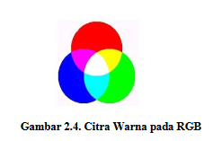
 

Pada gambar di atasdapat diambil beberapa kesimpulan yaitu: 

1. RGB terdiri dari tiga warna utama, yaitu merah, hijau, dan biru. 
2. Campuran dua warna pada RGB menghasilkan warna baru, yaitu kuning = merah + hijau, cyan = hijau + biru, dan magenta = biru + merah. 
3. Bila seluruh warna merah, hijau, dan biru dicampur akan menghasilkan warna putih. 
4. Bila warna merah, hijau, dan biru tidak dicampur maka akan menghasilkan warna hitam. 
5. Jenis warna lain akan dihasilkan oleh variasi campuran warna dan intensitas campuran setiap warna.

Tugas2 kali ini adalah diminta untuk mengeksplorasi gambar berukuran 32x32 dengan menggunakan format PNG, JPG, atau JPEG yang kemudian gambar tersebut akan di eksplorasi menggunakan software Octave dan harus menerapkan fungsi imread, imhist dan imshow.

Hasil Ekspolasi gambar 32x32 :
 

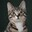
 

gambar diatas merupakan gambar yang akan saya gunakan untuk tugas kali ini
 

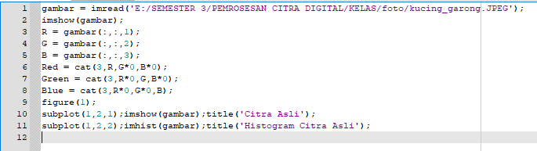
     

Gambar diatas merupakan kode yang saya gunakan untuk menampilkan gambar dan histogram dari citra asli gambar tersebut.
 

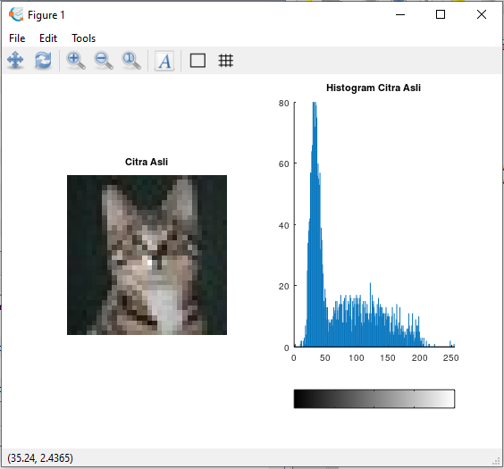
 

Gambar di atas merupakan hasil dari menampilkan Citra asli dan Histogramnya
 

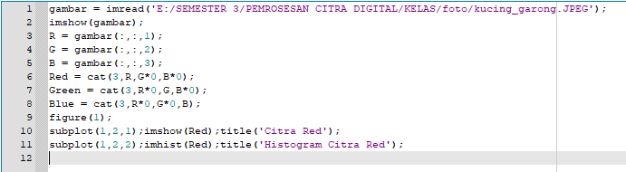
 

Gambar diatas merupakan kode yang saya gunakan untuk menampilkan gambar dan histogram dari citra Red gambar tersebut.
 

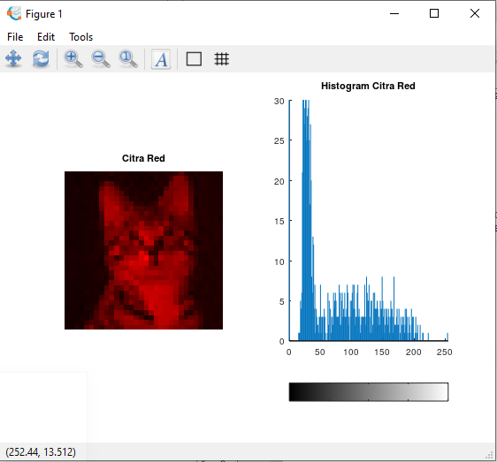
 

Gambar di atas merupakan hasil dari menampilkan Citra Red dan Histogramnya
 

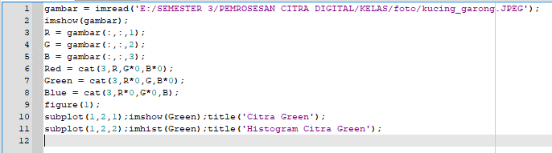
 

Gambar diatas merupakan kode yang saya gunakan untuk menampilkan gambar dan histogram dari citra Green gambar tersebut.
 

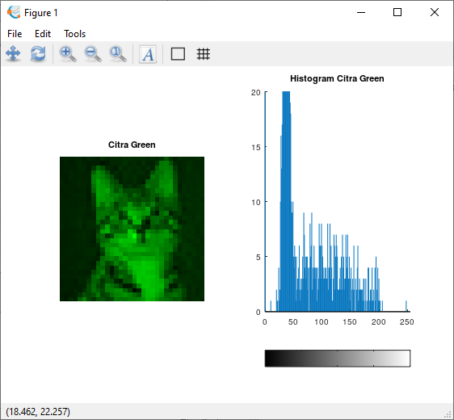
 

Gambar di atas merupakan hasil dari menampilkan Citra Green dan Histogramnya
 

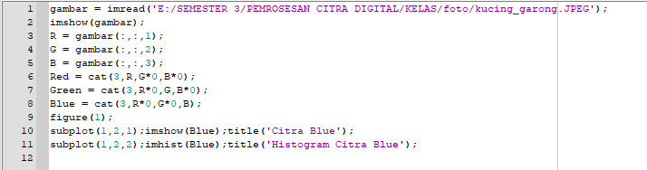
 

Gambar diatas merupakan kode yang saya gunakan untuk menampilkan gambar dan histogram dari citra Blue gambar tersebut.
 

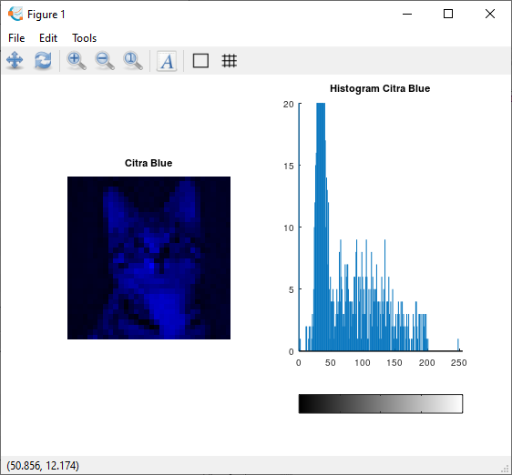
 

Gambar di atas merupakan hasil dari menampilkan Citra Blue dan Histogramnya
 

Penjelasasan dari beberapa fungsi yang telah saya pahami adalah sebagai berikut:
1. imread(image read) dapat digunakan ketika kita ingin memasukan foto ke dalam software octave maka kita bisa menggunakan fungsi ini. 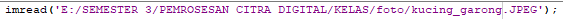
2. imshow(image show) dapat digunakan ketika kita ingin menampilkan gambar pada software Octave 
3. imhist(image histogram) dapat digunakan ketika kita ingin menmapilkan histogram dari gambar kita pada Octave 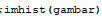
