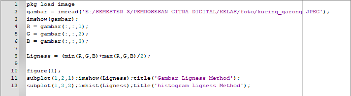
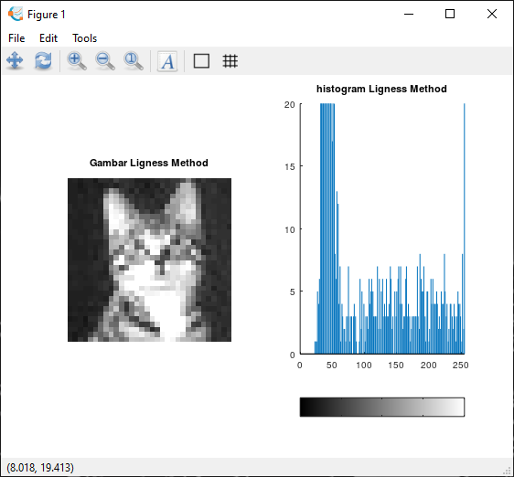
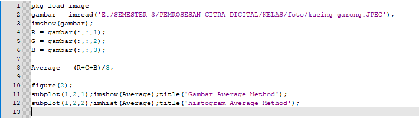
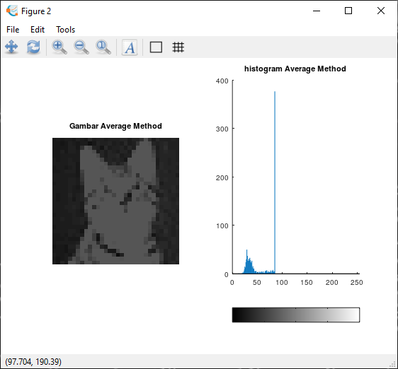
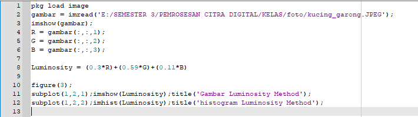
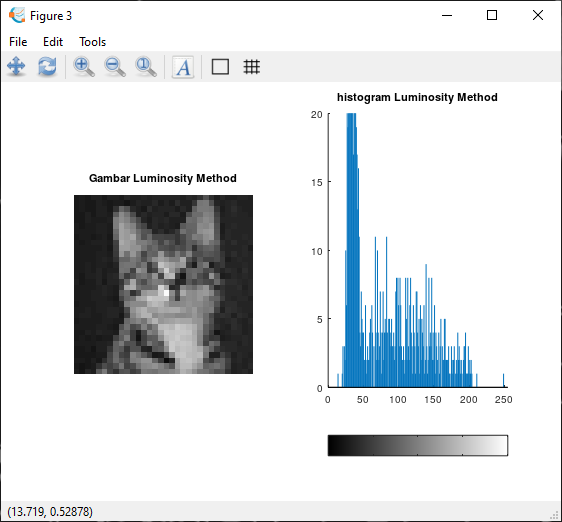

## Tugas 3 Pemerosesan Citra Digital
Nama   : Sesilia Miranda 
Nim    : 2110131220010

<h2 align="center">GRAYSCALE </h2>

Grayscale adalah suatu istilah untuk menyebutkan satu citra yang memiliki warna abu-abu, hitam, dan putih. Grayscale adalah koleksi atau kisaran corak monokromik (abu-abu), mulai dari putih murni di ujung yang paling terang hingga hitam murni di ujung yang berlawanan.

macam - macam metode untuk mengubah RGB menjadi grayscale :
1. Lightness Method
2. Avarge Method
3. Luminosity Method
  

<h3 align="center">Lightness Method</h3>

Gambar dibawah ini merupakan kode yang saya gunakan untuk mengubah gambar RGB menjadi Grayscale dengan menggunakan <b>Lightness Method</b>, menampilkan hasil gambar beserta histogram dari gambar tersebut.

     

Gambar dibawah ini merupakan hasil dari penerapan <b>Lightness Method</b>

   

<h3 align="center">Avarge Method</h3>

Gambar dibawah ini merupakan kode yang saya gunakan untuk mengubah gambar RGB menjadi Grayscale dengan menggunakan <b>Avarge Method</b>, menampilkan hasil gambar beserta histogram dari gambar tersebut.

     

Gambar dibawah ini merupakan hasil dari penerapan <b>Avarge Method</b>

   

<h3 align="center">Luminosity Method</h3>

Gambar dibawah ini merupakan kode yang saya gunakan untuk mengubah gambar RGB menjadi Grayscale dengan menggunakan <b>Luminosity Method</b>, menampilkan hasil gambar beserta histogram dari gambar tersebut.

     

Gambar dibawah ini merupakan hasil dari penerapan <b>Luminosity Method</b>

   
