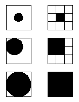
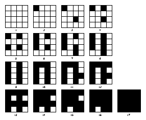
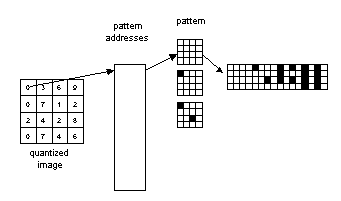
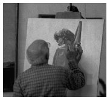
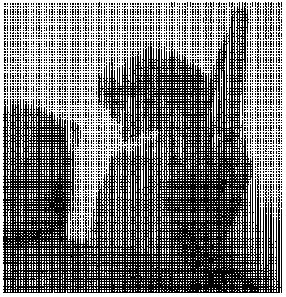
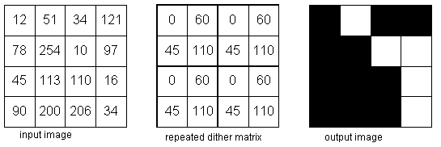
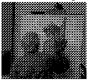

## Tugas 3 Pemerosesan Citra Digital
Nama   : Sesilia Miranda 
Nim    : 2110131220010

<h2 align="center">HALFTONING</h2>

Halftoning adalah proses yang mensimulasikan nuansa abu-abu dengan memvariasikan ukuran titik-titik hitam kecil yang diatur dalam Patterning yang teratur. Teknik ini digunakan dalam printer, serta industri penerbitan. Jika Anda memeriksa sebuah foto di koran, Anda akan melihat bahwa gambar itu terdiri dari titik-titik hitam meskipun tampaknya terdiri dari abu-abu. Hal ini dimungkinkan karena integrasi spasial yang dilakukan oleh mata kita. Mata kita memadukan detail halus dan merekam intensitas keseluruhan. Halftoning digital mirip dengan halftoning di mana gambar didekomposisi menjadi kotak sel halftone. Elemen (atau titik yang digunakan halftoning dalam mensimulasikan nuansa abu-abu) dari sebuah gambar disimulasikan dengan mengisi sel halftone yang sesuai. Semakin banyak jumlah titik hitam dalam sel halftone, semakin gelap sel tersebut. Misalnya, pada Gambar dIbawah ini, sebuah titik kecil yang terletak di tengah disimulasikan dalam halftoning digital dengan mengisi sel halftone tengah; demikian juga, titik ukuran sedang yang terletak di sudut kiri atas disimulasikan dengan mengisi empat sel di sudut kiri atas. Titik besar yang menutupi sebagian besar area pada gambar ketiga disimulasikan dengan mengisi semua sel halftone.

 

Metode umum untuk menghasilkan gambar halftoning anatar lain :
1. patterning
2. dithering
  

<h3 align="center">Patterning</h3>

Patterning adalah yang paling sederhana untuk menghasilkan gambar halftoning digital. Ini menghasilkan gambar yang memiliki resolusi spasial lebih tinggi daripada gambar sumber. Jumlah sel halftone citra keluaran sama dengan jumlah piksel citra sumber. Namun, setiap sel halftone dibagi lagi menjadi kotak 4x4. Setiap nilai piksel input diwakili oleh jumlah kotak terisi yang berbeda dalam sel halftone. Karena kisi 4x4 hanya dapat mewakili 17 tingkat intensitas yang berbeda, gambar sumber harus dikuantisasi.

Gambar dibawah ini menunjukkan matriks Patterning rekursif Rylander</b>

     

Gambar dibawah ini merupakan contoh operasi Patterning</b>

  

Gambar dibawah ini merupakan contoh gambar halftoning digital yang dihasilkan dari PAINTER menggunakan teknik Patterning</b>

 <b>Gambar Citra Asli</b>

 <b>Gambar Citra Pattering</b>
   

<h3 align="center">Dithering</h3>

Dithering adalah Teknik lain yang digunakan untuk menghasilkan gambar halftoning digital. Tidak seperti pola, dithering membuat gambar keluaran dengan jumlah titik yang sama dengan jumlah piksel pada gambar sumber. Dithering dapat dianggap sebagai thresholding gambar sumber dengan matriks gentar. Matriks diletakkan berulang kali di atas gambar sumber. Dimanapun nilai piksel gambar lebih besar dari nilai dalam matriks, titik pada gambar output diisi. Masalah dithering yang terkenal adalah menghasilkan artefak pola yang diperkenalkan oleh matriks ambang batas tetap.

Gambar dibawah ini menunjukkan contoh operasi dithering</b>

  

Gambar dibawah ini merupakan contoh penerapan operasi dithering</b>

 <b>Gambar Citra Asli</b>

 <b>Gambar Citra Dithering</b>
   

Sumber Ulasan : [klik untuk mengunjungi website yang saya gunakan sebagai ulasan](https://people.ece.ubc.ca/irenek/techpaps/introip/manual04.html)