## Tugas 5 Pemerosesan Citra Digital
Nama   : Sesilia Miranda 
Nim    : 2110131220010

<h2 align="center">EKSPERIMEN 1 : Bit Plane Slicing </h2>

<h4 align="center">Citra Asli</h4>

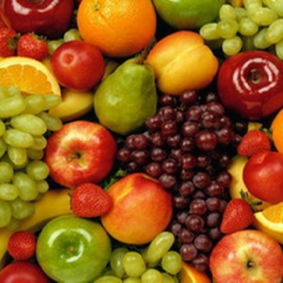
     

<h4 align = "center">Proses Mengubah citra asli menjadi citra grayscale</h4>

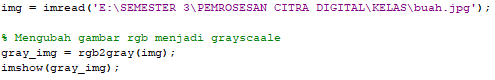
 

<h4 align="center">Citra Grayscale</h4>

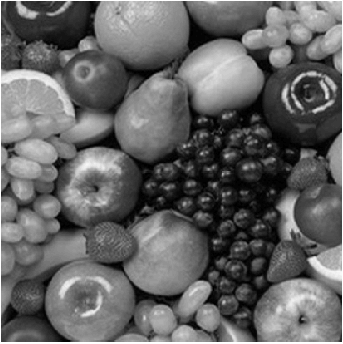
 

<h4 align = "center">Algoritma Penguraian Bit Plane SLicing</h4>

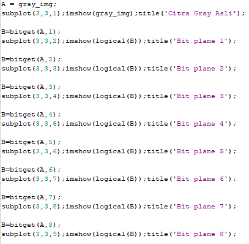
 

<h4 align = "center"><b>Output dari Penguraian Bit Plane SLicing</b></h4>

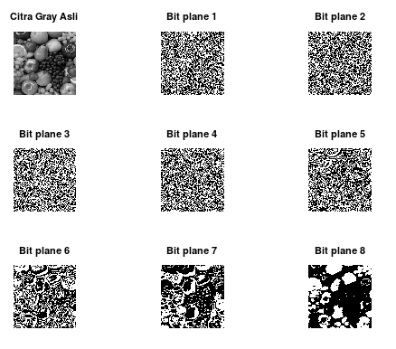
   

<h2 align="center">EKSPERIMEN 2 : Gabungkan Gambar Sendiri dengan Gambar Teman atau gambar lain dan Lihat Bit Plane Slicingnya</h2>

<h4 align="center">Citra Asli 1</h4>

  

<h4 align="center">Citra Asli 2</h4>

     

<h4 align = "center">Proses Menggabungkan 2 gambar menjadi 1</h4>

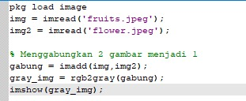
 

<h4 align="center">Citra Gabungan</h4>

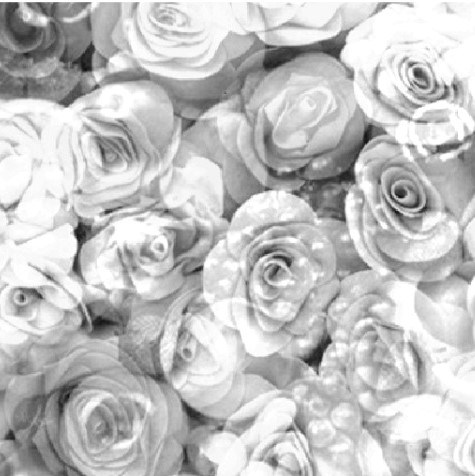
 

<h4 align = "center"><b>Penguraian Bit Plane SLicing</b></h4>

 

<h4 align = "center"><b>Output dari Penguraian Bit Plane SLicing</b></h4>

   

<h2 align="center">EKSPERIMEN 3 : Menerapkan Stegonography Pada Suatu Citra Grayscale</h2>

<h4 align="center">Citra Asli</h4>

   

<h4 align="center">Citra Asli yang diubah menjadi grayscale</h4>

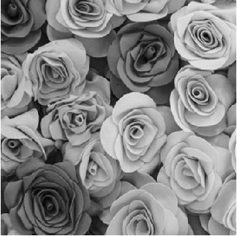
   

<h4 align="center">Proses Memasukan kode rahasia kedalam citra grayscale</h4>

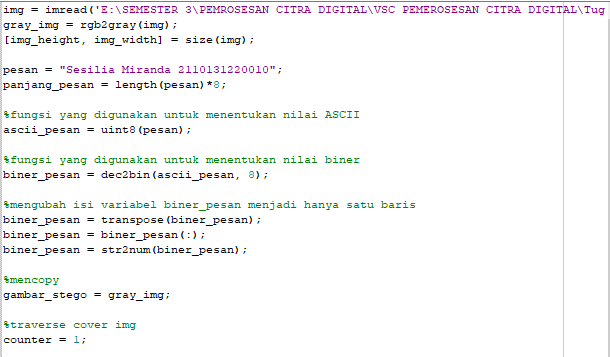

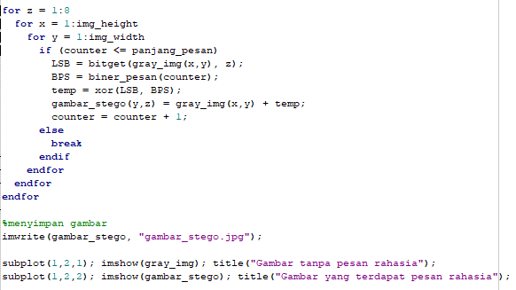
 

<h4 align = "center"><b>Output dari hasil Memasukan kode rahasia kedalam citra grayscale 
</b></h4>

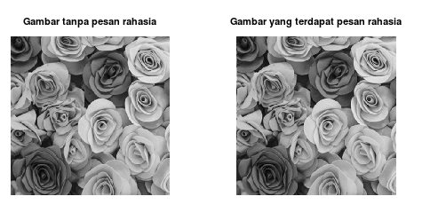
 