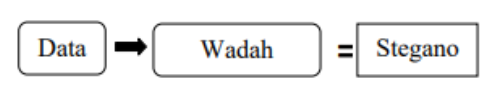

## Tugas 6 Pemerosesan Citra Digital
Nama   : Sesilia Miranda 
Nim    : 2110131220010

<h2 align="center">STEGANOGRAPHY</h2>

Steganografi adalah teknik menyembunyikan data rahasia di dalam file atau pesan biasa, non-rahasia, untuk menghindari deteksi; data rahasia kemudian diekstraksi di tujuannya. Penggunaan steganografi dapat dikombinasikan dengan enkripsi sebagai langkah ekstra untuk menyembunyikan atau melindungi data. Kata steganografi berasal dari kata Yunani steganos (artinya tersembunyi atau tertutup) dan akar kata Yunani graph (artinya menulis).

Steganografi dapat digunakan untuk menyembunyikan hampir semua jenis konten digital, termasuk teks, gambar, video atau konten audio; data yang akan disembunyikan dapat disembunyikan di dalam hampir semua jenis konten digital lainnya. Konten yang akan disembunyikan melalui steganografi -- disebut teks tersembunyi -- sering dienkripsi sebelum dimasukkan ke dalam file teks sampul atau aliran data yang tampak tidak berbahaya. Jika tidak dienkripsi, teks tersembunyi biasanya diproses dengan cara tertentu untuk meningkatkan kesulitan mendeteksi konten rahasia.

Untuk berbagai alasan, keamanan dan kerahasiaan sangat dibutuhkan dalam komunikasi data melalui internet, tak terkecuali sebuah pesan. Steganografi sebagai suatu seni penyembunyian pesan ke dalam suatu media yang banyak dimanfaatkan untuk mengirim pesan melalui jaringan internet tanpa diketahui orang lain. Steganografi berasal dari bahasa Yunani yaitu Steganos yang berarti menyembunyikan dan Graptos yang artinya tulisan, sehingga secara keseluruhan artinya adalah tulisan yang disebunyikan.

Menyembunyikan sebuah pesan dengan steganografi akan mengurangi kecurigaan dan peluang terdeteksinya keberadaan pesan oleh pihak ketiga. Media yang digunakan sebagai media pembawa (carrier file) dapat berupa teks, gambar, audio dan video. Salah satu carrier file dalam steganografi adalah gambar/citra digital, merupakan media yang paling sering digunakan karena sering dipertukarkan dalam dunia internet antara lain, JPEG, PNG, GIF dan BMP.

 <b>Properti Steganografi</b>
 

Dalam praktiknya, agar data menjadi lebih aman, data diacak terlebih dahulu menggunakan kriptografi, kemudian baru dilakukan proses steganografi agar lebih maksimal dalam mengamankan dan menjaga kerahasiaan. Steganografi membutuhkan dua properti, yaitu data dan wadah penampung data. wadah penampung yang umumnya digunakan berupa teks, suara, gambar, atau video. Sedangkan data yang disembunyikan dapat berupa teks, gambar, atau data yang lainnya.

<b>Keuntungan</b> menggunakan steganografi adalah memungkinkan pengiriman pesan secara rahasia tanpa diketahui bahwa pesan sedang dikirim karena pesan tersembunyi. Ini membuat pihak ketiga tidak menyadari keberadaan pesan. Sebaliknya, penggunaan kriptografi akan menarik kecurigaan pihak ketiga bahwa ada sesuatu yang disembunyikan dalam pesan yang sedang dikirim.

Terdapat teknik dasar dalam steganografi
 

1. teknik substitusi, 
2. teknik transform domain, 
3. teknik statistic, 
4. teknik distortion, dan 
5. teknik cover generation. 

Metode Steganography pada citra digital ada banyak, salah satunya terdiri dari metode sebagai berikut: 

 1. Least Significant Bit (LSB) Metode ini bekerja dengan cara mengganti bit terakhir dari masingmasing piksel dengan pesan yang akan disisipkan.LSB mempunyai kelebihan yakni ukuran gambar tidak akan berubah. Sedangkan kekurangannya adalah pesan/data yang akan disisipkan terbatas, sesuai dengan ukuran citra. Selain itu, kualitas citra akan sedikit berubah setelah mengalami proses penyisipan pesan.

 2. Most Significant Bit (MSB) Pada metode MSB, pesan disisipkan pada bit ke-1. Kelebihannya tingkat ketahanan pesan terhadap perubahan kontras citra baik, sehingga kerusakan pesan kecil dan masih dapat dibaca. Kekurangan metode ini ialah memiliki nilai MSE besar, sehingga kualitas citra sebelum penyisipan pesan jauh berbeda dengan citra sesudah penyisipan pesan.

Encoding dilakukan dengan menggunakan langkah-langkah berikut:

1. Siapkan sebuah citra gambar.
2. Jika citra yang disiapkan masih dalam bentuk RGB (berwarna) maka ubah gambar menjadi skala abu-abu (grayscale).
3. Ambil ukuran dari citra (width dan height).
4. Siapkan pesan yang ingin disisipkan ke dalam citra.
5. Konversikan pesan ke format binernya.
6. Ambil nilai ASCII dari setiap huruf dari pesan yang akan disisipkan.
7. Ambil nilai biner dari pesan yang akan disisipkan.
8. Ubah biner dari pesan menjadi dalam bentuk satu baris ke samping dengan fungsi transpose dan ubah arraynya dari tipe string menjadi numerik.
9. Inisialisasi gambar keluaran sama dengan gambar masukan.
10. Buat variabel counter yang memiliki 1 sebagai counter awal.
11. Telusuri setiap piksel gambar (menggunakan perulangan bersarang), selama counter masih kurang dari panjang pesan (length pesan) lakukan hal berikut:
    - Dapatkan LSB (Least Significant Bit) dari citra
    - Dapatkan bagian berikutnya dari pesan yang akan disematkan
    - Jika bit pesan dan LSB piksel sama, setel temp = 0
    - Jika bit pesan dan LSB piksel berbeda, setel temp = 1. Pengaturan temp ini dapat dilakukan dengan mengambil XOR bit pesan dan LSB piksel
    - Perbarui piksel gambar keluaran ke nilai piksel gambar masukan + temp
12. Terus perbarui gambar output hingga semua bit dalam pesan tertanam
13. Tuliskan gambar input dan output ke sistem lokal

Sumber Ulasan : [klik untuk mengunjungi website yang saya gunakan sebagai ulasan](https://www.techtarget.com/searchsecurity/definition/steganography)
