## Tugas 7 Pemerosesan Citra Digital
Nama   : Sesilia Miranda 
Nim    : 2110131220010

<h2 align="center">KONVOLUSI</h2>

&nbsp &nbsp &nbsp Konvolusi adalah operator matematika yang penting untuk banyak operator dalam image processing. Konvolusi menyediakan cara untuk menggabungkan dua array, biasanya untuk ukuran array yang berbeda, tetapi untuk dimensi array yang sama, menghasilkan array ketiga yang mempunyai dimensi yang sama. Konvolusi dapat digunakan dalam image processing untuk menerapkan operator yang mempunyai nilai output dari piksel yang berasal dari kombinasi linear nilai input piksel tertentu.

&nbsp &nbsp &nbsp Konvolusi citra adalah tehnik untuk menghaluskan suatu citra atau memperjelas citra dengan menggantikan nilai piksel dengan sejumlah nilai piksel yang sesuai atau berdekatan dengan piksel aslinya. Tetapi dengan adanya konvolusi, ukuran dari citra tetap sama, tidak berubah.

&nbsp &nbsp &nbsp Konvolusi citra adalah tehnik untuk menghaluskan suatu citra atau memperjelas citra dengan menggantikan nilai piksel dengan sejumlah nilai piksel yang sesuai atau berdekatan dengan piksel aslinya. Tetapi dengan adanya konvolusi, ukuran dari citra tetap sama, tidak berubah.

&nbsp &nbsp &nbsp Operasi konvolusi dilakukan dengan menggeser konvolusi kernel piksel per piksel. Hasil konvolusi disimpan di dalam matriks baru.
 

Contoh 1. Misalkan citra f(x,y) yang berukuran 5x5 dan sebuah kernel atau mask yang berukuran 3x3 masing-masing adalah sebagai berikut:

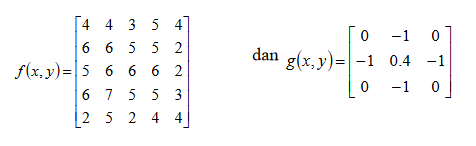 
 

Operasi konvolusi antara citra f(x,y) dengan kernel g(x,y), yaitu f(x,y) * g(x,y) dapat diilustrasikan sebagai berikut:

(1.) Tempatkan kernel pada sudut kiri atas, kemudian hitung nilai piksel pada posisi (0,0) dari kernel.

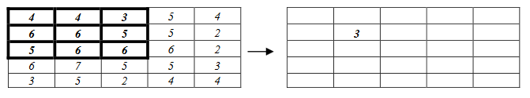 
 

Hasil konvolusi = 3. Nilai ini dihitung dengan cara berikut:  
(0x4) + (-1x4) + (0x3) + (-1x6) + (4x6) + (-1x5) + (0x5) + (-1x6) + (0x6) = 3

(2.) Geser kernel satu piksel ke kanan, kemudian hitung nilai piksel pada posisi (0,0) dari kernel:

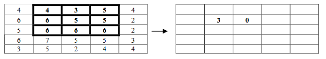 
 

Hasil konvolusi = 0. Nilai ini dihitung dengan cara berikut:  
(0x4) + (-1x3) + (0x5) + (-1x6) + (4x5) + (-1x5) + (0x6) + (-1x6) + (0x6) = 0

(3.) Geser kernel satu piksel ke kanan, kemudian hitung nilai piksel pada posisi (0,0) dari kernel:

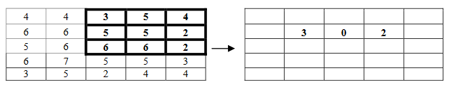 
 

Hasil konvolusi = 2. Nilai ini dihitung dengan cara berikut:  
(0x3) + (-1x5) + (0x4) + (-1x5) + (4x5) + (-1x2) + (0x6) + (-1x6) + (0x2) = 2

(4.) Geser kernel satu piksel ke bawah, lalu mulai lagi melakukan konvolusi dari sisi kiri citra. Setiap
kali konvolusi, geser kernel atau piksel ke kanan:

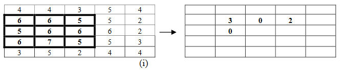 
 

Hasil konvolusi = 0. Nilai ini dihitung dengan cara berikut:  
(0x6) + (-1x6) + (0x5) + (-1x5) + (4x6) + (-1x6) + (0x6) + (-1x7) + (0x5) = 0

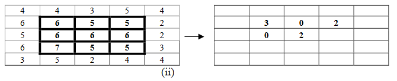 
 

Hasil konvolusi = 2. Nilai ini dihitung dengan cara berikut:  
(0x6) + (-1x5) + (0x5) + (-1x6) + (4x6) + (-1x6) + (0x7) + (-1x5) + (0x5) = 2

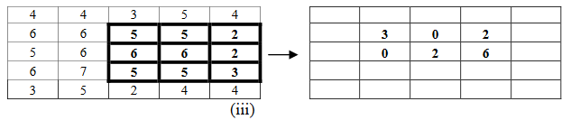 
 

Hasil konvolusi = 6. Nilai ini dihitung dengan cara berikut:  
(0x5) + (-1x5) + (0x2) + (-1x6) + (4x6) + (-1x2) + (0x5) + (-1x5) + (0x3) = 6
 

Dengan cara yang sama, piksel-piksel pada baris ketiga di konvolusi sehingga menghasilkan:

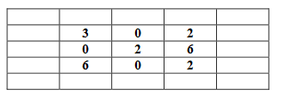 
 

&nbsp &nbsp &nbsp Jika hasil konvolusi menghasilkan nilai piksel negative, nilai tersebut dijadikan 0. Sebaliknya jika hasil konvolusi menghasilkan nilai piksel lebih besar dari nilai keabuan maksimum (255), nilai tersebut dijadikan ke nilai keabuan maksimum.

&nbsp &nbsp &nbsp Masalah timbul bila piksel yang dikonvolusi adalah piksel pinggir, karena beberapa koefisien konvolusi tidak dapat diposisikan pada piksel-piksel citra, seperti contoh di bawah ini:

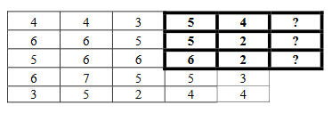 
 

Solusi untuk masalah ini adalah : 
1. piksel-piksel pinggir diabaikan, tidak dikonvolusi, jadi nilai piksel pinggir sama dengan nilai pada citra semula; 
2. duplikasi elemen citra, misalnya elemen kolom pertama disalin ke kolom M+1 dst.; 
3. elemen bertanda “?” diasumsikan bernilai 0 atau konstanta lain, sehingga konvolusi pinggir-pinggir dapat dilakukan.

&nbsp &nbsp &nbsp Solusi dengan ketiga pendekatan di atas mengasumsikan bagian pinggir citra lebarnya sangat kecil (hanya satu piksel) relative dibandingkan dengan ukuran citra, sehingga piksel-piksel pinggir tidak memperlihatkan efek yang kasat mata.

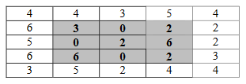 Gambar 3 Piksel-piksel pinggir
 

&nbsp &nbsp &nbsp Dalam algoritma konvolusi citra N x M dengan mask atau kernel yang berukuran 3 x 3 piksel yang dikonvolusi adalah elemen (i,j). Delapan buah piksel yang bertetangga dengan piksel (i,j) diperlihatkan pada Gambar 4.

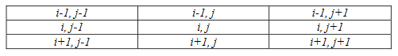 Gambar 4 Delapan piksel yang bertetangga dengan piksel (i,j)
 

&nbsp &nbsp &nbsp Dapat dilihat bahwa operasi konvolusi merupakan komputasi pada area lokal, karena komputasi untuk suatu piksel pada citra keluaran melibatkan piksel-piksel tetangga pada citra masukannya.

<h2 align="center">PENERAPAN PADA OCTAVE</h2>

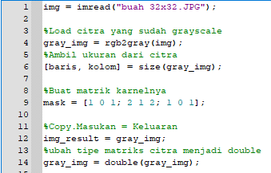
 

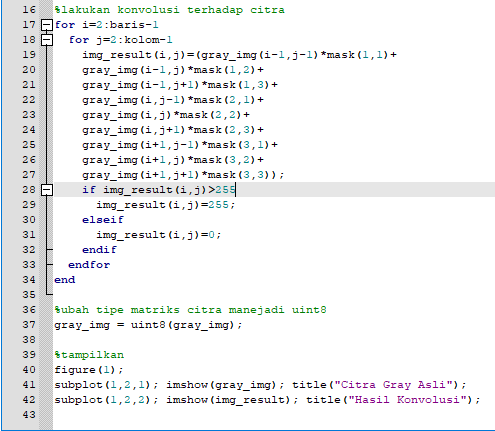
  

<h4 align="center">OUTPUT</h4>

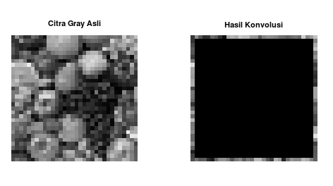
 

Sumber Ulasan : [klik untuk mengunjungi website yang saya gunakan sebagai ulasan](http://research-dashboard.binus.ac.id/uploads/paper/document/publication/Journal/MatsTat/Vol.%2012%20No.%202%20Juli%202012/01_Wikaria%20Gazali.pdf)
