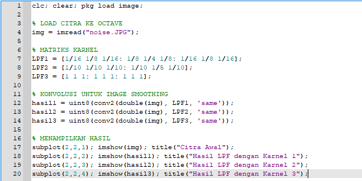

## Tugas 8 Pemerosesan Citra Digital
Nama   : Sesilia Miranda 
Nim    : 2110131220010

<h2 align="center">PENERAPAN FILTER BAIK MENGGUNAKAN FUNGSI MAUPUN SECARA MANUAL</h2>
<h3 align="center">Low Pass Filtering</h3>

Menggunakan Fungsi Octave : 

 
 

 
 

Menggunakan Cara manual : 

 
 

 
 